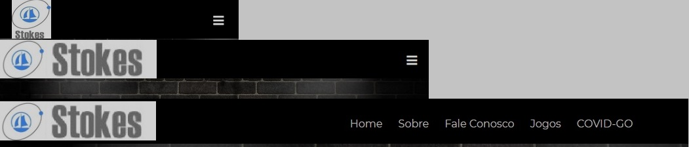
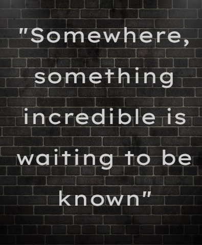
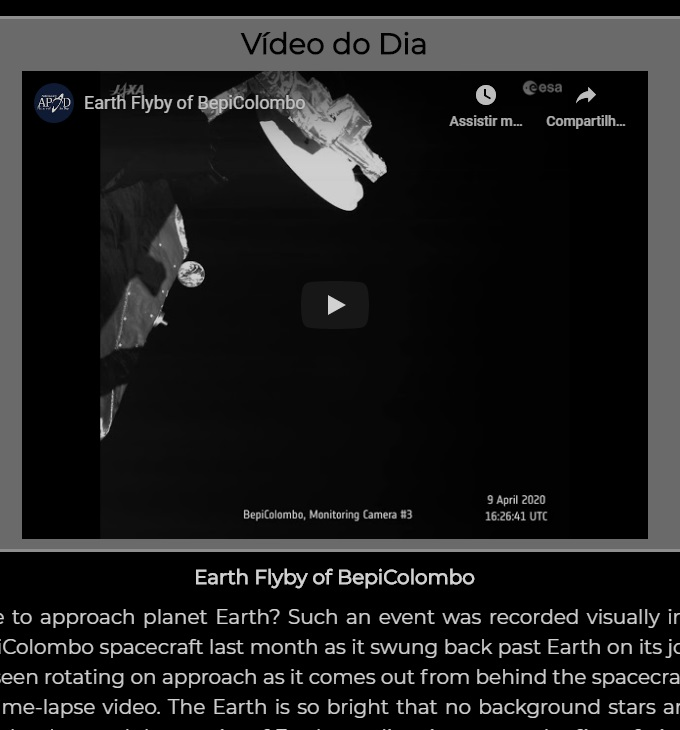
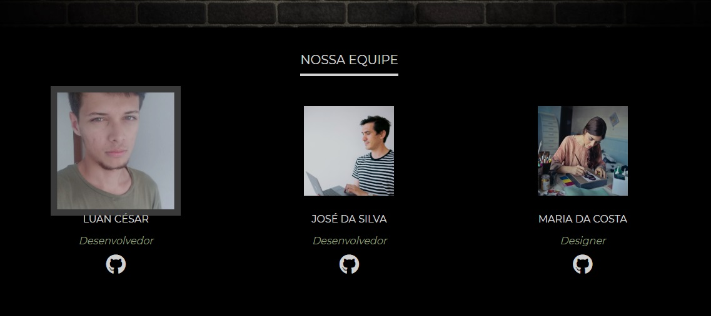
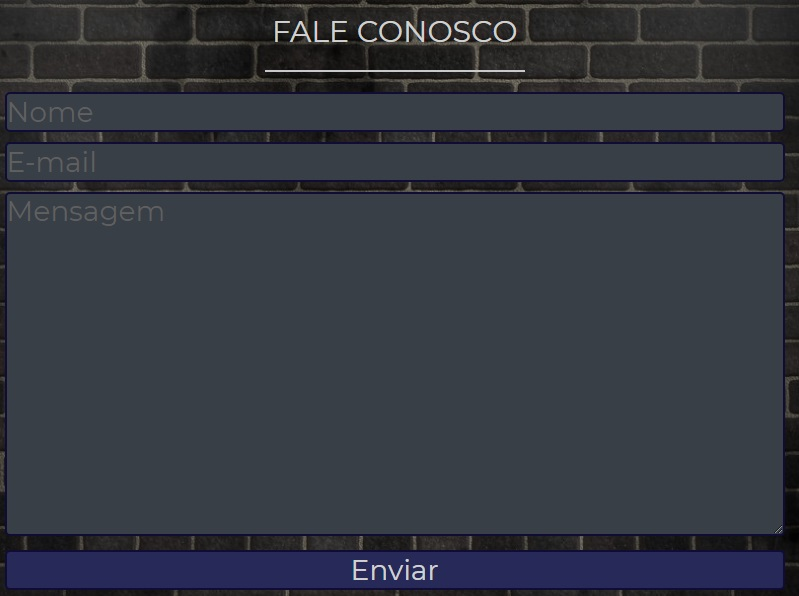
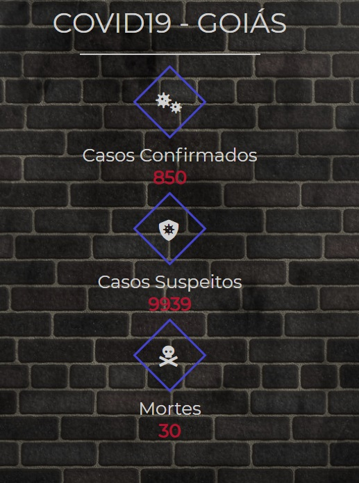
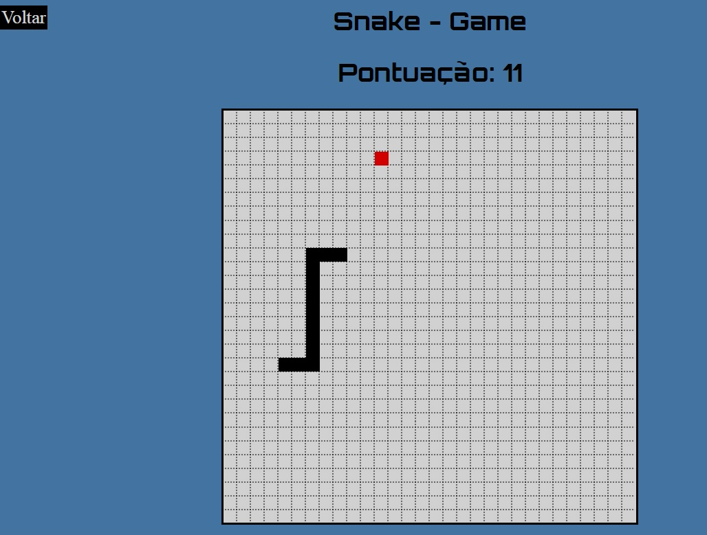

# Site para o Processo Seletivo Level5
Repositório destinado à hospedagem do código do site criado para o processo seletivo da Empresa Junior Level5, alocada na Universidade Federal de Goiás.

## Objetivo Geral
Desenvolver um site institucional utilizando HTML5 e CSS. O tema do site é livre, contanto que se encaixe na categoria pedida.
## Requisitos
- [x] Possuir uma página home e uma página sobre.
- [x] Possuir no mínimo mais 1 página além destas.
- [x] Ser responsivo.
- [x] Possuir o código bem indentado.
- [x] Utilizar as tags HTML corretamente.
- [x] Utilizar alguma das APIs descritas no PDF enviado para extrair algum dado que será utilizado no site.

## Link do Site
[Site_Level](https://sitelevel.000webhostapp.com/index.html)

## Home Page
- 3 tipos de menu, a depender da largura da página.

- Texto inicial da página

- Imagem ou Vídeo do dia. (Api da [Nasa](https://data.nasa.gov/Space-Science/Astronomy-Picture-of-the-Day-API/ez2w-t8ua)).

## Sobre
- Texto explicativo sobre a instituição.

- Apresentação da Equipe participante.

## Fale Conosco
- Formulário de comunicação com a equipe da instituição.

## Covid-GO
- Informações atualizadas a respeito do Covid-19 em Goiás. (Api da [UFG](https://covidgoias.ufg.br))

## Jogos
- Jogo da Cobrinha feito inteiramente em Javascript usando o Canvas. (Ainda precisa de melhorias)

## Bibliografia/Webgrafia usada no projeto
- [W3Schools](https://www.w3schools.com/)
- [NodeStudioTreinamentos (Youtube)](https://www.youtube.com/channel/UCZZ0NTtOgsLIT4Skr6GUpAw)
- [CursoEmVideo](https://www.youtube.com/user/cursosemvideo)
- [TreinaWeb](https://www.treinaweb.com.br/)
- [DevMozilla](https://developer.mozilla.org/en-US/docs/Web)
- Entre outras documentações e tutoriais.
- Além disso, usei o site da [Level5](https://level5jr.com.br/) como modelo para tirar algumas duvidas.

## APIs usadas

- [Nasa](https://data.nasa.gov/Space-Science/Astronomy-Picture-of-the-Day-API/ez2w-t8ua)
- [UFG Covid-go](https://covidgoias.ufg.br)

# Bibliotecas usadas

- [JQuery](https://jquery.com/)

# Recursos adicionais

- [Google Fonts](https://fonts.google.com/)
- [Fontawesome](https://fontawesome.com/)

